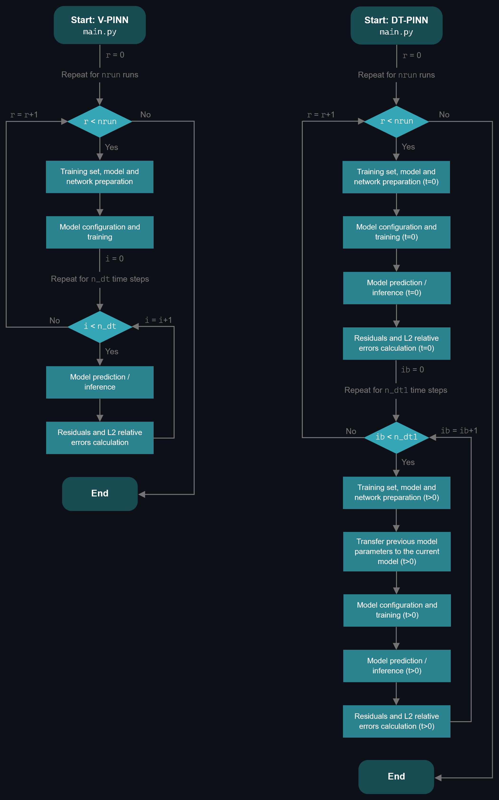
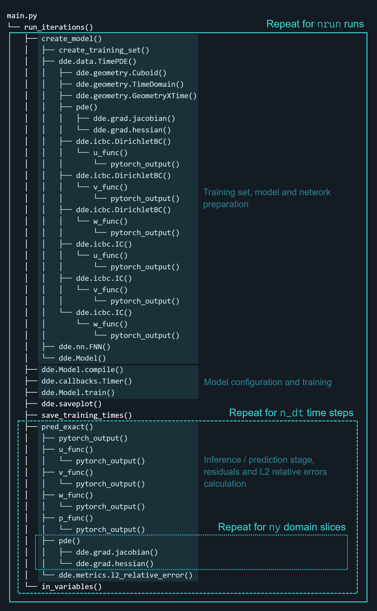
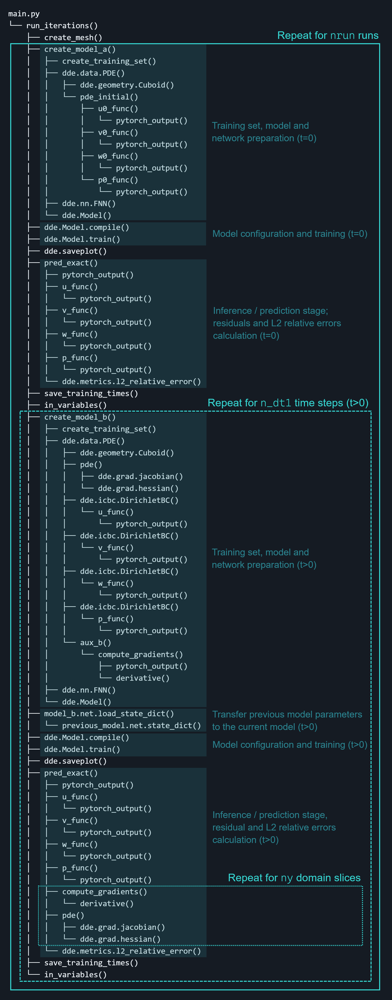

# Benchmarking Continuous and Discrete-Time PINNs on the Three-Dimensional Beltrami Flow

This repository contains the code and the data files containing the computational results reported at the document in annex, titled **Benchmarking Continuous and Discrete-Time PINNs on the Three-Dimensional Beltrami Flow**. This document also presents a detailed explanation on the fundamental concepts behind the work, methodology, implementation and metrics used. It is advised to read it for a full understanding of the project here published.

## Overview

The work compares the continuous-time or vanilla PINNs (V-PINNs) with discrete-time PINNs (DT-PINNs), each of which with and without Adaptive Loss Weights (ALW) — variable weights and fixed weights, respectively — for solving the three-dimensional (3D) transient Navier-Stokes equations, using the Beltrami flow analytical solutions as references.

The experiments investigate model accuracy, convergence and performance across the case studies considered.

## Codes and execution flow

This project uses the [DeepXDE](https://github.com/lululxvi/deepxde) framework [1]. The `model.py` file from DeepXDE source code is modified (see `model_MOD.py`) to implement the ALW algorithm.

The implementation is based on the [Beltrami Flow example](https://github.com/lululxvi/deepxde/blob/master/examples/pinn_forward/Beltrami_flow.py) provided in the DeepXDE documentation, with substantial modifications to accomodate the project requirements. These can be seen in every `beltrami_*_0` through `beltrami_*_3` folder.

In summary: this project starts from an existing implementation from DeepXDE, which was then transformed to support methodologies that are were not supported by that implementation. The table below presents a side-by-side comparison between the DeepXDE original work and the implementation here presented.

| Aspect | DeepXDE reference | My implementation |
|---|---|---|
| Beltrami flow | Continuous-time example | Continuous and discrete-time formulations |
| Loss weighting | Fixed | Fixed and Adaptive weighting |
| Code organization | Single script | Modular structure |

In the image below one can see the execution flow charts presenting the core operations performed by the V-PINN (left) and DT-PINN (right) implementations, summarizing the codes present in every `beltrami_*_0` through `beltrami_*_3` folder.

In both V-PINN and DT-PINN implementations, the execution starts in `main.py`, with a function call to `iterationsss()`, which is where the instructions and other function calls needed to run the code are placed according to the instruction flow. The operations inside function `iterationsss()` (except for the test set definition in DT-PINN, by calling the `create_mesh()` function) run in loop for a user-defined `nruns` number of runs.

### V-PINN execution

The function `create_model()` is called. Inside it, `create_training_set()` is called, where the training set `training_set_run{r}_ORI.csv` present in the respective `RUN_1000_*` folder is extracted for the current run `r`. Then, the problem definition is set by `dde.data.TimePDE()`: 3D transient Navier-Stokes equations subject to constraints: a space-time domain, boundary and initial conditions (Beltrami flow analytical solutions in the domain boundaries and at t=0, respectively). The PINN architecture is then defined and the model (`model`) is composed by the problem (`data`) plus the network (`net`). Back to `iterationsss()`: the PINN is then trained for a user defined number of iterations (i.e., number of times the network weights are updated) and the loss history is saved. 

For each time step (or instant) `i`: the function `pred_exact()` is called, where the velocity and pressure fields are predicted in the test set from the trained model and these results are evaluated by computing the residuals and L2 relative errors between the predicted and exact results in the test set. The residuals calculation, through the `pde()` function, involves computing many derivatives through automatic differentiation, which is a memory-consuming task, whose usage increases with the number of data points where these gradients are computed. As such, the three-dimensional test set (with `nx` * `ny` * `nz` points) is divided into `ny` 2D sub-domains (or slices) of `nx` * `nz` points. The residuals are then calculated in each sub-domain, are stored in memory, and the cached data regarding hessians and jacobians is clean (`dde.grad.clear()`), in a sequential process, avoiding data accumulation across the `ny` loops, saving memory resources compared to standard residuals calculation without domain slicing.

When the inference and evaluation for the time step `i` is completed, function `in_variables()` is called, where the average values of the evaluated metrics are stored in `final_data` file. The cycle "inference-evaluation-storage" repeats for all time steps (until `n_dt`), and the execution ends. Optionally, the predicted, exact, relative errors and residuals at the test points can also be saved in csv files, which can be useful for visualizing results in software such as [Paraview](https://www.paraview.org/).

<strong>Click to view the detailed V-PINN code execution and function-call flow.</strong>

### DT-PINN execution

The code execution is divided into two main stages: for initial time (t=0) and remaining time steps (t>0). The process is analogous to the V-PINN: the training set `training_set_run{r}_ORI.csv` present in the respective `RUN_1000_*` folder is extracted for the current run `r`, for `model_a`, corresponding to t=0. The initial-time problem is set by the function `dde.data.PDE()`: fitting the analytical solution at t = 0. The full model (`model_a`) is the neural network (standard MLP, `net_a`) plus the problem to optimize (`data_a`), which is then trained and the loss history is saved. After training and saving, the solutions for t=0 are predicted from `model_a`, and these results are evaluated against the exact solutions through the L2 relative error metric. Finally, the average values of the evaluated metrics are stored in `final_data` file.

Then, for t>0, a similar process to the one described in the paragraph above is performed at each time step, sequentially, with some important differences. The problem to address for a time step `ib`, by calling `dde.data.PDE()`, is the 3D Navier-Stokes equations with a second-order midpoint time discretization (`pde()`), with boundary conditions given by the analytical solutions in the boundaries (`bc_ic()`). After the model (`model_b`) is fully defined, the weights and biases from the trained PINN of the previous time step are copied to the current PINN, and then it is trained. After training, lie the inference and evaluation stages.

Note that for t=0, no residual is computed. The network for `model_a` is trained by minimizing the residuals of the initial condition constraint, rather than by minimizing the 3D Navier-Stokes equations at each time instant, for each `model_b`, at t>0. A residual computed at t=0 evaluates the mismatch between the predicted results and the analytical solution at that instant, and the residual computed at any instant t>0 quantifies the satisfaction of the Navier-Stokes equation. Therefore, there residuals represent different quantities and are not directly comparable. Besides, the accuracy of the predictions at t=0 is already assessed by the L2 relative errors, making the residual calculation based on the initial condition a redundant operation.

<strong>Click to view the detailed DT-PINN code execution and function-call flow.</strong>

In both cases, after code execution, many more statistics can be analysed by performing post-processing on the data that was saved during code execution, by running the code `post_processing_V_PINN.py` or `post_processing_DT_PINN.py`, depending on the case. Some of these statistics were directly used in the report and are referred in the "**Correspondence between results from the report and the data files**" section of this README.

Hidden below (shown by clicking in "Function and module overview"), lies a table presenting the functions, the .py files where these are defined, and the purpose of these functions within the implementation considered (V-PINN or DT-PINN).

<strong>Function and module overview</strong>

<table class="tg">
<thead>
  <tr>
    <th class="tg-7btt">Function / operation</th>
    <th class="tg-7btt">File</th>
    <th class="tg-7btt">Purpose (V-PINN)</th>
    <th class="tg-7btt">Purpose (DT-PINN)</th>
  </tr>
</thead>
<tbody>

  <tr>
    <td class="tg-amwm">—</td>
    <td class="tg-baqh"><code>Makefile</code></td>
    <td class="tg-baqh" colspan="2">
      The <code>make clean</code> command removes <code>__pycache__</code> directories and <code>*.log</code> files.
    </td>
  </tr>

  <tr>
    <td class="tg-7btt">—</td>
    <td class="tg-c3ow"><code>main.py</code></td>
    <td class="tg-9wq8" colspan="2">
      Entry point; calls <code>run_iterations()</code>.
    </td>
  </tr>

  <tr>
    <td class="tg-7btt">—</td>
    <td class="tg-c3ow"><code>prm.py</code></td>
    <td class="tg-7btt">—</td>
    <td class="tg-c3ow">
      Defines the variables, parameters, and settings used by the DT-PINN codes.
    </td>
  </tr>

  <tr>
    <td class="tg-7btt">—</td>
    <td class="tg-c3ow"><code>param.py</code></td>
    <td class="tg-c3ow">
      Defines the variables, parameters, and settings used by the V-PINN codes.
    </td>
    <td class="tg-7btt">—</td>
  </tr>

  <tr>
    <td class="tg-jq7i"><code>run_iterations()</code></td>
    <td class="tg-c3ow"><code>iterationsss.py</code></td>
    <td class="tg-9wq8" colspan="2">
      Controls the main execution flow, including model creation, training, inference, and data storage.
    </td>
  </tr>

  <tr>
    <td class="tg-c3ow"><code>create_mesh()</code></td>
    <td class="tg-c3ow"><code>results.py</code></td>
    <td class="tg-7btt">—</td>
    <td class="tg-c3ow">
      Creates the structured mesh used as the test set.
    </td>
  </tr>

  <tr>
    <td class="tg-c3ow"><code>create_model_a()</code></td>
    <td class="tg-c3ow"><code>model_nn.py</code></td>
    <td class="tg-7btt">—</td>
    <td class="tg-c3ow">
      Creates the PINN problem and neural network for the initial time, <i>t</i> = 0.
    </td>
  </tr>

  <tr>
    <td class="tg-baqh"><code>create_model()</code></td>
    <td class="tg-baqh"><code>model_nn.py</code></td>
    <td class="tg-baqh">
      Creates the PINN for the fully continuous transient problem.
    </td>
    <td class="tg-amwm">—</td>
  </tr>

  <tr>
    <td class="tg-c3ow"><code>create_training_set()</code></td>
    <td class="tg-c3ow"><code>bc_ic.py</code></td>
    <td class="tg-c3ow" colspan="2">
      Loads the training points.
    </td>
  </tr>

  <tr>
    <td class="tg-c3ow"><code>dde.data.PDE()</code>, <i>t</i> = 0</td>
    <td class="tg-c3ow"><code>model_nn.py</code></td>
    <td class="tg-7btt">—</td>
    <td class="tg-c3ow">
      Defines the initial-time problem by fitting the analytical solution at <i>t</i> = 0.
    </td>
  </tr>

  <tr>
    <td class="tg-baqh"><code>dde.data.TimePDE()</code></td>
    <td class="tg-baqh"><code>model_nn.py</code></td>
    <td class="tg-baqh">
      Defines the fully continuous transient 3D Navier–Stokes problem subject to the specified constraints.
    </td>
    <td class="tg-amwm">—</td>
  </tr>

  <tr>
    <td class="tg-c3ow"><code>dde.geometry.Cuboid()</code></td>
    <td class="tg-c3ow"><code>bc_ic.py</code></td>
    <td class="tg-7btt">—</td>
    <td class="tg-c3ow">
      Defines the 3D spatial domain and geometry.
    </td>
  </tr>

  <tr>
    <td class="tg-baqh"><code>dde.geometry.TimeDomain()</code></td>
    <td class="tg-baqh"><code>bc_ic.py</code></td>
    <td class="tg-baqh">
      Defines the time domain.
    </td>
    <td class="tg-amwm">—</td>
  </tr>

  <tr>
    <td class="tg-baqh"><code>dde.geometry.GeometryXTime()</code></td>
    <td class="tg-baqh"><code>bc_ic.py</code></td>
    <td class="tg-baqh">
      Combines the spatial and temporal domains into a single space-time domain.
    </td>
    <td class="tg-amwm">—</td>
  </tr>

  <tr>
    <td class="tg-baqh"><code>dde.icbc.IC()</code></td>
    <td class="tg-baqh"><code>bc_ic.py</code></td>
    <td class="tg-baqh">
      Enforces the analytical solution as the initial condition at <i>t</i> = 0.
    </td>
    <td class="tg-amwm">—</td>
  </tr>

  <tr>
    <td class="tg-c3ow"><code>pde_initial()</code></td>
    <td class="tg-c3ow"><code>model_nn.py</code></td>
    <td class="tg-7btt">—</td>
    <td class="tg-c3ow">
      Computes the residuals between the neural network predictions and the analytical solution at <i>t</i> = 0.
    </td>
  </tr>

  <tr>
    <td class="tg-c3ow">
      <code>u0_func()</code>, <code>v0_func()</code>, <code>w0_func()</code>, <code>p0_func()</code>
    </td>
    <td class="tg-c3ow"><code>analytical_solution.py</code></td>
    <td class="tg-7btt">—</td>
    <td class="tg-c3ow">
      Computes the analytical solutions for the velocity components <i>u</i>, <i>v</i>, <i>w</i> and pressure <i>p</i> at <i>t</i> = 0.
    </td>
  </tr>

  <tr>
    <td class="tg-c3ow"><code>pytorch_output()</code></td>
    <td class="tg-c3ow"><code>numpy_to_torch.py</code></td>
    <td class="tg-c3ow" colspan="2">
      Converts input data into PyTorch tensors.
    </td>
  </tr>

  <tr>
    <td class="tg-c3ow"><code>dde.nn.FNN()</code></td>
    <td class="tg-c3ow"><code>model_nn.py</code></td>
    <td class="tg-c3ow" colspan="2">
      Defines the fully connected neural network architecture.
    </td>
  </tr>

  <tr>
    <td class="tg-c3ow"><code>dde.Model()</code></td>
    <td class="tg-c3ow"><code>model_nn.py</code></td>
    <td class="tg-c3ow" colspan="2">
      Creates the DeepXDE model from the problem definition and neural network.
    </td>
  </tr>

  <tr>
    <td class="tg-c3ow"><code>dde.Model.compile()</code></td>
    <td class="tg-c3ow"><code>iterationsss.py</code></td>
    <td class="tg-c3ow" colspan="2">
      Configures the model for training.
    </td>
  </tr>

  <tr>
    <td class="tg-baqh"><code>dde.callbacks.Timer()</code></td>
    <td class="tg-baqh"><code>iterationsss.py</code></td>
    <td class="tg-baqh">
      Sets the maximum training time, in minutes.
    </td>
    <td class="tg-amwm">—</td>
  </tr>

  <tr>
    <td class="tg-c3ow"><code>dde.Model.train()</code></td>
    <td class="tg-c3ow"><code>iterationsss.py</code></td>
    <td class="tg-c3ow" colspan="2">
      Trains the neural network by minimizing the defined loss function.
    </td>
  </tr>

  <tr>
    <td class="tg-c3ow"><code>dde.saveplot()</code></td>
    <td class="tg-c3ow"><code>iterationsss.py</code></td>
    <td class="tg-c3ow" colspan="2">
      Saves the training loss history.
    </td>
  </tr>

  <tr>
    <td class="tg-c3ow"><code>pred_exact()</code></td>
    <td class="tg-c3ow"><code>results.py</code></td>
    <td class="tg-c3ow">
      Performs model inference at the test set and computes the PDE residuals and L2 relative errors.
    </td>
    <td class="tg-c3ow">
      Infers the current model at the test set and computes the PDE residuals and L2 relative errors.
    </td>
  </tr>

  <tr>
    <td class="tg-c3ow">
      <code>u_func()</code>, <code>v_func()</code>, <code>w_func()</code>, <code>p_func()</code>
    </td>
    <td class="tg-c3ow"><code>analytical_solution.py</code></td>
    <td class="tg-c3ow" colspan="2">
      Computes the analytical solutions for the velocity components <i>u</i>, <i>v</i>, <i>w</i> and pressure <i>p</i>.
    </td>
  </tr>

  <tr>
    <td class="tg-c3ow"><code>dde.metrics.l2_relative_error(a, b)</code></td>
    <td class="tg-c3ow"><code>results.py</code></td>
    <td class="tg-c3ow" colspan="2">
      Computes the L2 relative error between variables <i>a</i> and <i>b</i>.
    </td>
  </tr>

  <tr>
    <td class="tg-c3ow"><code>save_training_times()</code></td>
    <td class="tg-c3ow"><code>store_data.py</code></td>
    <td class="tg-c3ow">
      Records and saves the training time for each run.
    </td>
    <td class="tg-c3ow">
      Records and saves the training time for each time step and run.
    </td>
  </tr>

  <tr>
    <td class="tg-c3ow"><code>in_variables()</code></td>
    <td class="tg-c3ow"><code>store_data.py</code></td>
    <td class="tg-c3ow" colspan="2">
      Organizes and saves the metrics and prediction data produced by <code>pred_exact()</code>.
    </td>
  </tr>

  <tr>
    <td class="tg-c3ow"><code>create_model_b()</code></td>
    <td class="tg-c3ow"><code>model_nn.py</code></td>
    <td class="tg-7btt">—</td>
    <td class="tg-c3ow">
      Creates the PINN for the current time step (<i>t</i> &gt; 0).
    </td>
  </tr>

  <tr>
    <td class="tg-c3ow"><code>dde.data.PDE()</code>, <i>t</i> &gt; 0</td>
    <td class="tg-c3ow"><code>model_nn.py</code></td>
    <td class="tg-7btt">—</td>
    <td class="tg-c3ow">
      Defines the 3D Navier–Stokes problem with second-order time discretization, subject to the specified constraints.
    </td>
  </tr>

  <tr>
    <td class="tg-c3ow"><code>pde()</code></td>
    <td class="tg-c3ow"><code>ns_equations.py</code></td>
    <td class="tg-c3ow">
      Computes the residuals of the fully continuous transient 3D Navier–Stokes equations, including spatial and time derivatives of the model predictions.
    </td>
    <td class="tg-c3ow">
      Computes the residuals of the discretized 3D Navier–Stokes equations with second-order midpoint time discretization and spatial derivatives of the current time step predictions.
    </td>
  </tr>

  <tr>
    <td class="tg-c3ow"><code>dde.grad.jacobian()</code>, <code>dde.grad.hessian()</code></td>
    <td class="tg-c3ow"><code>ns_equations.py</code></td>
    <td class="tg-c3ow" colspan="2">
      Computes first- and second-order spatial derivatives, respectively, using DeepXDE automatic differentiation.
    </td>
  </tr>

  <tr>
    <td class="tg-c3ow"><code>dde.icbc.DirichletBC()</code></td>
    <td class="tg-c3ow"><code>bc_ic.py</code></td>
    <td class="tg-c3ow" colspan="2">
      Enforces the analytical solutions as Dirichlet boundary conditions on the domain boundaries.
    </td>
  </tr>

  <tr>
    <td class="tg-c3ow"><code>aux_b()</code></td>
    <td class="tg-c3ow"><code>model_nn.py</code></td>
    <td class="tg-7btt">—</td>
    <td class="tg-c3ow">
      Supplies the previous time step predictions and respective spatial derivatives to <code>pde()</code>.
    </td>
  </tr>

  <tr>
    <td class="tg-c3ow"><code>compute_gradients()</code></td>
    <td class="tg-c3ow"><code>previous_model_grad.py</code></td>
    <td class="tg-7btt">—</td>
    <td class="tg-c3ow">
      Infers the previous model and computes the spatial derivatives of these predictions at the training or test points; organizes these quantities into the format required by <code>pde()</code>.
    </td>
  </tr>

  <tr>
    <td class="tg-baqh"><code>derivative()</code></td>
    <td class="tg-baqh"><code>previous_model_grad.py</code></td>
    <td class="tg-amwm">—</td>
    <td class="tg-baqh">
      Computes first- and second-order spatial derivatives using PyTorch automatic differentiation.
    </td>
  </tr>

</tbody>
</table>

## Directory Structure

The directory structure for this project reflects the procedure used for training the models, namely, the 24 model implementations and hyperparameter combinations (case studies) analysed, while maximizing the usage of the hardware resources available. 

    continuous-discrete-pinn-beltrami/
    ├── fixed_weights/
    │   ├── DT_PINN/
    │   │   ├── beltrami_DT_PINN_0/
    │   │   │   ├── RUN_1000_sigmoid_1e_4/
    │   │   │   │   └── CSV_post_processing/
    │   │   │   └── RUN_1000_tanh_1e_3/
    │   │   │       └── CSV_post_processing/
    │   │   ├── beltrami_DT_PINN_1/
    │   │   │   ├── RUN_1000_sigmoid_1e_5/
    │   │   │   │   └── CSV_post_processing/
    │   │   │   └── RUN_1000_tanh_1e_4/
    │   │   │       └── CSV_post_processing/
    │   │   ├── beltrami_DT_PINN_2/
    │   │   │   └── RUN_1000_tanh_1e_5/
    │   │   │       └── CSV_post_processing/
    │   │   └── beltrami_DT_PINN_3/
    │   │   │    └── RUN_1000_sigmoid_1e_3/
    │   │   │        └── CSV_post_processing/
    │   └── V_PINN/
    │       ├── beltrami_V_PINN_0/
    │       ├── beltrami_V_PINN_1/
    │       ├── beltrami_V_PINN_2/
    │       └── beltrami_V_PINN_3/
    ├── variable_weights/
    │   ├── DT_PINN/
    │   │   ├── beltrami_DT_PINN_0/
    │   │   ├── beltrami_DT_PINN_1/
    │   │   ├── beltrami_DT_PINN_2/
    │   │   └── beltrami_DT_PINN_3/
    │   └── V_PINN/
    │       ├── beltrami_V_PINN_0/
    │       ├── beltrami_V_PINN_1/
    │       ├── beltrami_V_PINN_2/
    │       └── beltrami_V_PINN_3/
    ├── memory_usage/
    ├── figures/
    │   ├── flow_chart.png
    │   ├── vpinn_scheme.png
    │   └── dtpinn_scheme.png
    ├── model_MOD.py
    ├── model_ORIGINAL.py
    ├── tables_report.xlsx
    ├── README.md
    └── LICENSE

- `fixed_weights/` contains experiments using fixed loss weights.
- `variable_weights/` contains experiments using adaptive/variable loss weights.
- `DT_PINN/` contains the discrete-time PINN implementations.
- `V_PINN/` contains the continuous-time (or vanilla) PINN implementations.
- `beltrami_*_0/` through `beltrami_*_3/` correspond to the four identical GPUs (GPU number 0 to 3) used to run four different case studies in parallel. Each of these folders contain the codes needed to run the experiments.
- `RUN_*/` is a naming convention stating the hyperparameter combination used for each case study, from left to right in the folder naming: number of training points, activation function, initial learning rate. This is where the training sets and the training times for the experiments are stored.
- `CSV_post_processing/` contains the processed data directly used to generate the accuracy and convergence results presented in the report.
- `memory_usage/` contains the memory usage registrations, in steps of 10 ms, during training.
- `figures\` contains the figures present in this README.
- `model_MOD.py` is the modified `model.py` file from DeepXDE source code, where the ALW was implemented (besides some functions related to stopping criteria, not used for the report).
- `model_ORIGINAL.py` is the standard, non-modified `model.py` file present in the DeepXDE version considered for this project, and used for the fixed loss weighting tests.
- `tables_report.xlsx` contains the data and further post-processing needed to build the tables present in the report.

For example, the data files stored at `continuous-discrete-pinn-beltrami/V_PINN/beltrami_V_PINN_1/RUN_1000_sigmoid_1e_5` correspond to the case study where the model was trained with vanilla PINNs, using GPU number 1, with sigmoid activation function and initial learning rate equal to $10^{-5}$.

## Correspondence between results from the report and the data files

The correspondence between the the figures or tables from which the results are extracted and the output files of `post_processing_V_PINN.py` or `post_processing_DT_PINN.py` (or the .xlsx file) is presented below.

Figure 2:
- `continuous-discrete-pinn-beltrami/*_weights/V_PINN/beltrami_V_PINN_*/RUN_1000_*/CSV_post_processing/min_max_total_losses.csv`
- `continuous-discrete-pinn-beltrami/*_weights/V_PINN/beltrami_V_PINN_*/RUN_1000_*/CSV_post_processing/avg_loss_components.csv`
  
Figure 3:
- `continuous-discrete-pinn-beltrami/*_weights/V_PINN/beltrami_V_PINN_*/RUN_1000_*/CSV_post_processing/avg_res_l2errors_v2_time.csv`

Figure 4:
- `continuous-discrete-pinn-beltrami/*_weights/DT_PINN/beltrami_DT_PINN_*/RUN_1000_*/CSV_post_processing/avg_loss_components_ts0.csv`

**Note:** for the red/blue line, any file `avg_loss_components_ts0.csv` from any case study with DT-PINNs and tanh/sigmoid is suitable, since the files are all equal.

Figure 5:
- `continuous-discrete-pinn-beltrami/*_weights/DT_PINN/beltrami_DT_PINN_*/RUN_1000_*/CSV_post_processing/avg_loss_components.csv`

Figure 6:
- `continuous-discrete-pinn-beltrami/*_weights/DT_PINN/beltrami_DT_PINN_1/RUN_1000_sigmoid_1e_5/CSV_post_processing/avg_loss_components.csv`
- `continuous-discrete-pinn-beltrami/*_weights/DT_PINN/beltrami_DT_PINN_2/RUN_1000_tanh_1e_5/CSV_post_processing/avg_loss_components.csv`
  
Figure 7:
- `continuous-discrete-pinn-beltrami/*_weights/DT_PINN/beltrami_DT_PINN_*/RUN_1000_*/CSV_post_processing/avg_res_l2errors_v2_time.csv`
  
Figure 8:
- `continuous-discrete-pinn-beltrami/fixed_weights/V_PINN/beltrami_V_PINN_3/RUN_1000_sigmoid_1e_3/CSV_post_processing/avg_res_l2errors_v2_time.csv`
- `continuous-discrete-pinn-beltrami/variable_weights/DT_PINN/beltrami_DT_PINN_0/RUN_1000_sigmoid_1e_4/CSV_post_processing/avg_res_l2errors_v2_time.csv`
- `continuous-discrete-pinn-beltrami/variable_weights/DT_PINN/beltrami_DT_PINN_2/RUN_1000_tanh_1e_5/CSV_post_processing/avg_res_l2errors_v2_time.csv`
- `continuous-discrete-pinn-beltrami/variable_weights/DT_PINN/beltrami_DT_PINN_1/RUN_1000_sigmoid_1e_5/CSV_post_processing/avg_res_l2errors_v2_time.csv`

Table II:
- `continuous-discrete-pinn-beltrami/*_weights/V_PINN/beltrami_V_PINN_*/RUN_1000_*/CSV_post_processing/avg_res_l2errors_v2_time.csv`
- `continuous-discrete-pinn-beltrami/tables_report.xlsx` (tab "V_PINN")

Table III:
- `continuous-discrete-pinn-beltrami/*_weights/DT_PINN/beltrami_DT_PINN_*/RUN_1000_*/CSV_post_processing/avg_res_l2errors_v2_time.csv`
- `continuous-discrete-pinn-beltrami/tables_report.xlsx` (tab "DT_PINN")

Table IV:
- `continuous-discrete-pinn-beltrami/memory_usage/vram_*_vpinn_*.csv`
- `continuous-discrete-pinn-beltrami/tables_report.xlsx` (tab "performance")

Table V:
- `continuous-discrete-pinn-beltrami/memory_usage/vram_*_dtpinn_*.csv`
- `continuous-discrete-pinn-beltrami/tables_report.xlsx` (tab "performance")

## Hardware and Software setup

The code was developed and the experiments were performed using the configuration below:

- **Architecture:** x86-64 (virtualized)
- **CPU model:** Intel Xeon Silver 4214R
- **Memory:** 256 GB RAM
- **GPU:** Nvidia Tesla V100S PCIe 32 GB
- **Nvidia driver version:** 555.42.02
- **CUDA version:** 12.6
- **Operating System:** Ubuntu 20.04.6 LTS
- **ML Backend:** PyTorch 2.9.1+cu126
- **PINNs Framework:** DeepXDE 1.15.0

The computations for the present work are performed in single precision, using a single GPU for training and inferencing. The codes are run in deterministic mode, meaning that for the same inputs, software and hardware configuration, the results results should be constant for every run. However, the exact code used for the report was later organized and some variable names were changed to facilitate its comprehension: the lastest version is the one available in this repository. While the operations and execution flow remain unchanged between both versions of the code, it was verified that, likely due to the modifications performed, some of the results shown in the report may not be reproducible by the code available, even if using the exact same hardware and software configuration written above.

## Installing and running the code

To install the 

## References

[1] L. Lu, X. Meng, Z. Mao, and G. E. Karniadakis, "DeepXDE: A Deep Learning Library for Solving Differential Equations”, *SIAM Review*, vol. 63, no. 1, p. 208–228, Jan. 2021. [Online]. Available: http://dx.doi.org/10.1137/19M1274067

